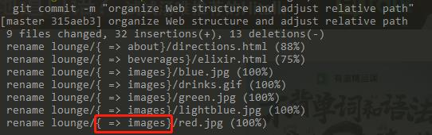
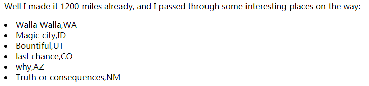
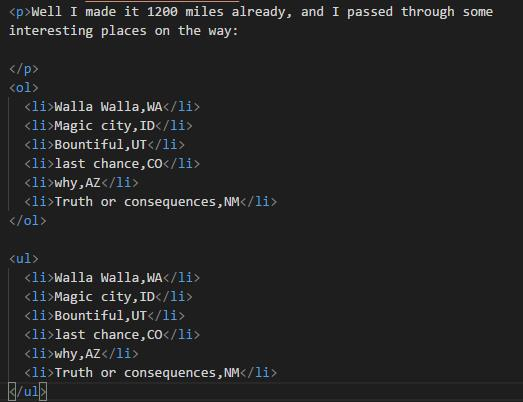
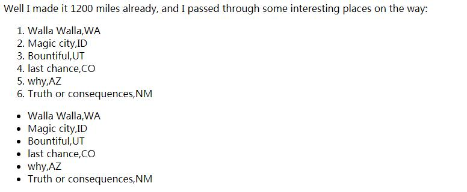
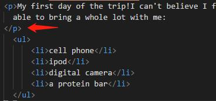
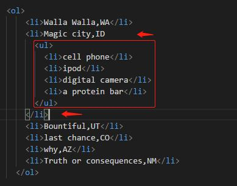

# 1. 认识HTML

- html 结构，CSS 样式
- #d2b48c 十六进制码
- CSS 中的“body"表示｛｝中的所有 CSS 要应用于 HTML  body 元素中的内容，即主体中的内容。


- Q: border: 2px red; 
 为什么显示不出来？

- CSS： 好的设计和布局有利于页面的可读性和可用性
- 记得幼儿园课里有讲过html和css是结构和样式分离
- HTML 和 CSS 是我们用来创建网页的语言。
- Web服务器存储并提供由HTML和CSS创建的网页。浏览器获取页面，并根据HTML和CSS显示网页的内容。P36
- HTML 是超文本标记语言（HyperText Markup Language）的缩写，用来建立网页的结构。 
- CSS是层叠样式表（Cascading Style Sheets)的缩写，用来控制HTML的表现。
- 元素: 标记名+尖括号+内容; " h1 /h1 "成对的匹配标记：告诉浏览器页面的结构;
  有些元素除外，如 img 。
- 开始标记可以有属性。
- 所有页面都要有一个 html 元素，其中要有一个 head 元素和一个  body 元素。
- 网页的信息放在 head 元素里。
 - head 只能放 meta、title、style 元素 P246
 - 一定要放 title 
- body 元素里的内容就是你将在浏览器里看到的东西。
- 大多数空白符 （制表符、回车、空格）都会被浏览器忽略，不过可以利用空白符让你的HTML更有可读性。
- style 元素总要放在 head 元素里。
- 可以使用CSS在HTML中指定元素的特性。
- em 元素： emphasize 强调：显示斜体; P92: 显示斜体，不好用，可以用别的方式。

## 填字游戏: P37
记英语单词，方便以后看英文。    

1. Q: heading: 一共有6个
3. presentation 表现：要控制表现时，会使用CSS。应该就是样式。
4. 结构 Struture
6. Q: 50SKITSCH
8. attribute 属性
10. whitespace 空白符
12. 通过STYLE来控制表现。
15. element
16. tag标记

# 2 深入了解超文本
HT(Hyper Text) : 链接到其他页面（文本）的文本

## 2.1 创建链接
<a>元素和href属性

####  a 元素
【想像成 at 】
 - 作用：创建链接。  a  /a 中的内容：链接文本，或者说标签，显示有下划线，【也就是网页上显示可单击的文本或图片，带链接的文字或图片】。
 

#### href 属性
 - 本义：词典：“abbr. 超文本引用（hypertext reference）；超链接” ;
 - 作用：通过href=""指定链接的目标文件;  
 - 格式： a href="要链接的文件">文本 /a ;
 - 目标文件：可以是html，图片，也可以是pdf等各种资源。
 - 运行：单击一个链接时，浏览器会加载href属性中指定的Web页面。
 - 注意 a 元素外 与 内 的描述中的空格

## 属性：
关于属性的理解

### 组成
- 属性名：如href;
- 等于号=;
- 属性值：用""括起来

### 原理
【这相当于JS里的对象的逻辑。也是，任何事物都是带着属性的。如果要表示事物，则会表示其属性;区别在于，表示的形式不同而已。】

### 相关
- HTML5支持定制数据属性，包括属性名。【Q:意思是说，HTML5可以自己定制属性？】
- 元素有自己的属性
- 属性就是功能:元素是结构，属性是元素的功能，也就是具体结构的功能。

### 其他
- img src ="" 可以单独用，比如 [这里](lounge.html) ;  
  也可以放在a元素里，P55。例子以后找，Q。
- 有些属性是必要的，如 src，alt ；有些属性是可选的。

## 2.2 用文件夹组织网站

- 组织文件的依据：灵活，可扩展，简单
- 在网站构建初期组织文件

### 链接路径
- 相对路径：从包含这个链接的页面开始，沿着一条路径，经过一些文件夹直到找到你需要指向的那个文件。
- 用于链接网站内的页面。
- “../” ： 上级文件夹、上行一个文件夹。第一个点指本文件夹，第二个点指上一层文件夹。  
  上行一个文件夹找另一个文件夹，或者说“上一级目录里的另一个文件夹”
  “../..” ：上行两级文件夹
- Web中的斜杠只有“/”，通用分隔符
- 有关路径的长度，对于大型网站，规范中建议当心超过255个字符。【Q:什么规范 ？】
- 不要使用空格

### 题外：关于 Git


# 3.构建模块

- 基本构建模块：h1、h2、h3、p等
- 从大的结构元素来考虑页面的构成：标题、段落、图像，等等。

## 构建Web步骤:  
第一、二章也是这样，只是这一章重点讲。

1. 草图：【内容的布局：需要表现的内容，列一下大概的表现形式。标题、图片、段落，这些要怎么放。其实就是排版】
2. 略图：【html结构略图：抽象成html模块要怎么排版】
3. 网页：【html文档：用html元素确定的网页】


### 学习新元素
#### q 引用元素

- 格式：自动在浏览器页面加“”;但有的浏览器不会自动加“”;非英语语言有相应的显示，不一定是“”。
- 作用：
  - 短引用，在 p 段落里;
  - 设置引用的样式;
  - 用最合适的方式来显示引用内容【添加有关引用的拓展功能】，比如，移动设备的显示，语音HTML功能和大屏幕阅读器【Q:找例子】，或搜索引擎可搜寻包含引用的网页。

#### blockquote 引用元素
- 格式：换行，具体样式自定义，目前在Chrome里是“空一行，过一行，空一行”，跟教材上一样，如下图：

- 作用：
  - 单独长引用; 在段落外，自成一段
  - 内部可多段，用 p 元素;
  - 内部可用 q ，例如，引用块中引用了别人的话。嵌套引用。
  - 指定样式，因为不同浏览器对 blockquote 的显示不一样。
     - 有些浏览器会缩进;

## 页面文本流
【页面布局 和 元素 的关系，元素在文本中】
### 元素 分类方式1：
  - 内联（inline）元素 : 
    - 作用：标记小段内容;
    - 形式：在行内出现;【行内表现】 ,跟其包含元素的其余内容放在一起。
    - 如： img、q 、 a 、 em 等
  - 块（block）元素：
    - 作用：Web页面中的主要构建模块;
    - 形式：前后各有一个换行;
    - 如： blockquote 、 h1、a、ul、li、ol、... p 等
    - 【HTML的换行用块元素的使用来u现，让网页在浏览器上的显示宽度可自由调整】：  
       在HTML文件中的换行符不会出现，使用块元素，浏览器就会使用换行符来分隔每一“块”
    - 在前后的垂直方向上显示间距 P195
  - br：模糊地带
### 元素在布局上的选用: 
  - 设计一个页面时，一般先从较大的块开始（块元素），然后在完善页面时再加入内联元素。
  - 在用CSS控制HTML表现时，区分好内联元素和块元素，可以轻松设计好布局。


####  br 元素
换行
【联想： line break：换行符 】
- 形式：只有开始标记，没有内容的元素。简写
- 作用：只是换行
- 与 br/ 作用一样。 br/ 与XHTML兼容，语法更严格。HTML中使用 br 。【对教材中内容提取还不够严谨，等了解XHTML再说】

### 元素 分类方式2：
  - 正常元素
  - void 元素
    - 空元素，无内容，无值
    -  img  、 br 

## 心法
选择与内容结构含义最接近的HTML元素。产生更大的能力和灵活性。


#### HTML列表
-  li ： li 每个列表项 /li   (list item)
  - 列表项在 p 段落外
    
- 包围所有列表项:归为一组
  -  ol 元素：有序列表(order list)
   - 自动编号
  -  ul 元素：无序列表(unordered list)
    - 最好不要用不同的项目符号。待CSS部分讲。
  
  
  - 都只能包含 li 

-- 都属于块元素
-- 最好把 /p 放在下一行

-- 可以嵌套


- 定义列表
 -  dl :定义术语
 -  dt :定义描述
```
Bruna Shave Signs
     Road Signs common in the U.S. in the 1920s and 1930s advertising shaving products.
Route 66
     Most famous road in the U.S. highway system.
```

## 心法 - 嵌套关系
### 关系：
- html 
  - head 
    - title
  - body
    - p 
      - q
      - em

### 相关：
- 确保标记匹配
- 提到 工业强度的HTML

#### 字符实体 【Q】
character entity
- 是一种简写缩写
- 分为 实体名 和 编号缩写
- 浏览器显示的字符，如果是html、md中的标记，那么，在html、md等文件里需要用实体字符代替。

查询地址1：
<a href="http://www.w3schools.com/tags/ref_entities.asp">http://www.w3schools.com/tags/ref_entities.asp</a>

查询地址2：
<a href="http://www.unicode.org/charts">http://www.unicode.org/charts</a>

自动翻译地址：
<a href="http://www.w3schools.com/tags/ref_entities.asp">http://www.w3schools.com/tags/ref_entities.asp</a>

需要运行环境支持相应的字体

#### 复习
- 空元素没有内容。不过它有开始和结束。
=> 不就是 br 和 img这类有开始没有结束的吗？还是说，只没有放内容？

# 4. Travel the Web
### 服务器
在Web上发布网页，需要一个在Web上全天候工作的服务器。
### 域名： 
starbuzz.com 是域名， www.starbuzz.com, corporate.starbuzz.com是网站。
同一个域名上的不同前缀是不同网站。
### 根文件夹 root
- 根文件夹是页面的顶级文件夹。  
- 在Web服务器上，根文件夹中的内容可以从网上访问到。
- 根文件夹可能有不同的名字，但最重要是，知道在哪里。
- 把根文件夹全部复制到对应网站的根文件夹下。
  - 通过FTP文件传输方法 (file transfer protocol)

### 用 FTP 传输
- cd 切换到目标文件夹
- put 将文件传到服务器
- mkdir 创建新目录
- get 获取文件
- dir 得到当前目录的文件列表，查看文件夹
- pwd 查看当前路径
- bye 退出

### 统一资源占位符 
#### Web地址 - URL - Uniform Resource Locators 
##### 组成
- 指定协议：
- 全局地址：
  - 标识和指定 Web 上的任意资源
  - `绝对路径`
    - `从根文件夹到一个文件的路径`：  
       “/”表示“根” + 导航到目标文件所经过的每一个文件夹 + 文件夹名之间加“/” + 文件名index.html
    - 用于链接其他网站 

`一个协议 + 一个网站名或说域名 + 资源的一个绝对地址`  
例如 /index.html 属于绝对路径

##### 具体分工
- 协议告诉浏览器应当使用什么方法来获取资源。
- 网站部分（由服务器名和域名组成）告诉浏览器要从互联网上的哪个计算机获取资源。 
- 绝对路径：告诉服务器要找哪个页面。
##### 相关
- 相对路径 转换成 绝对路径：
  单击一个相对链接时，在后台浏览器会根据这个相对路径和所单击页面的路径创建一个绝对路径。  
  【这句话应该有点不对，当文件在服务器上时，是由服务器内部的文件转换的，比如 express 框架。】 
  所有Web服务器看到的都是绝对路径。

- 响应目录请求：而不是文件请求
  - 在目录中创建默认文件，通常为默认文件名为 index.html 或 default.htm 或其他。（具体要看服务器的默认设置，default的后缀通常没有l）
  - 服务器收到末尾没有“/”,会自动加上，默认得到请求地址为“/index.html”。


#### HTTP
超文本传输协议： HyperText Transfer Protocol
是在Web上传输超文本文档的公认的一种方法（协议）。  
是一个请求和响应协议，用来在`web服务器和浏览器之间传送web页面`。  

尽管“超文本文档”通常只是指HTML页面，但这个协议实际上还可以用来传输图像或Web页面可能需要的任何其他文件。  
HTTP是一个简单的请求和响应协议。  
HTTP请求：我能得到文件/index.html吗？ 
HTTP响应：我找到这个文件了，给你。 / #404错误，我找不到这个文件。
输入Web地址 - 向服务器请求相应资源 - 找到资源 - 返回给浏览器
【Q: 不使用 www 前缀，而直接用home.之类的，有没有用到协议？】

#### FTP
File Transfer Protocol,文本传输协议    
是`向服务器传送web页面和内容`的常用方法。

#### FILE协议
浏览器使用file协议从你的计算机读取页面。


  
#### 端口
通常Web上的所有东西都会传送到一个默认端口（80），不过有时Web服务器会配置为在另外一个不同端口接收请求。这种情况经常在测试服务器上出现。正常的Web服务器几乎都在端口80接收请求。
【如果网站是一个地址，端口就是更细分的房间号】
  
#### title 属性
- 名称：链接描述
- 作用：工具提示，最常用
- 运用：浏览器可以读出链接标题，帮助视力障碍人士。

- 任何元素都可以使用 title 属性
- 除了 a 元素，其他元素中的 title 可能有其他用途。

### 链接改善
- 让链接标签简短，即 a 元素中间的描述。用title来补充说明。
- 改善页面的可读性，【帮助用户理解链接的作用】
    
#### a 元素的 id 属性

链接页面的特定位置  
带 id 的元素 的特性：可以直接链接这些元素。
用 id 属性在页面中创建一个目标。
使用#id,链接到页面中的目标位置。

1. 创建 id 锚点： 
  - 选择要链接到的页面和位置：任何文本，通常选标题
  - 使用 id 属性，创建锚点，即锚点名/标识符名 :   
    - 所选位置的元素的开始标记里 加上 id 属性，如 `<h1 id ="">`
    - 查看页面源码，使用现有锚点
  - 锚点名区分`大小写`，用`字母开头`，不能有空格
  - 锚点名在页面需要是唯一的，不重复的文本。
2. 扣上锚点：
  - 回到起点页面 【起点：链接地址】
  - 在 a 元素开始标记中 href 属性的URL地址后加上 `"#锚点"`:   
    - 如 a href ="http:// ....com/index.html#Coffee"  
    - 不知道默认文件是否为index.html，可以直接用 "http:// ....com/#Coffee"
    - 当起点和锚点在同一页面时，href="#[锚点名]” 
  - 注意区分大小写


【Q 例子】a 元素能用文字和图像（内联内容）`创建链接`，现在html5还可以从块元素 p 和 blockquote 创建链接。

#### target 属性
- 作用：打开一个新的标签或窗口（是标签或窗口则看浏览器的设置）  
- 运用： 
  - `=_blank` ：总是打开新窗口
  - `=coffee"`: 为相同目标名coffee的链接，会在同一个窗口打开   
  【Q:怎么操作？】  
`target="_blank" href="" title=""`  
-> 在target处打开href链接，显示title的提示。  

# 5. 增加图像
整章讨论 img 元素  
显示图像前，先获取图像。逐个获取。  
图像不是html文件的一部分，而是单独存在的。

## 图像格式
最常用三种。  
|格式|JPG|PNG|GIF|
|-|-|-|-|
|颜色呈现|连续色调|单色和线条构成|单色和线条构成|
|颜色数量|1600万种|上百万种|256种|
|压缩|有损|无损|无损|
|透明|不透明|多色透明，无锯齿|单色透明|
|文件大小|较小|可大可小，取决于色数|比相应的JPEG大|
|动画|不支持|不支持|支持|
|||最新格式|最早格式|

PNG-8: 256色
PNG-16: 数千种颜色
PNG-24: 数百万种颜色    

GIF 可用8种颜色很好的表现线图、图形之类的图像，  
但考虑到背景的顺滑透明，  
似乎还是 PNG 比较保险，而且 PNG 体积可能比GIF还小。    
即，  
透明选用 PNG ;
动图选用 GIF ;   
而JPG，当然是照片格式首选。

### img 元素 详解
- 内联
- void
#### src 属性
src=""  
- 指向图像文件的位置/地址
  - 可以是相对链接
  - 也可以是URL：最后一般是图片文件名
#### alt 属性  
alt=""  
作用：提示图像内容，或在让屏幕阅读器为视力障碍者描述图像内容。
在无法打开图像的情况下，alt会代替图像，显示""中的提示内容。
在不同的浏览器中显示方式不同：safari 不会显示
#### width-height 属性
width=""  
height=""   
- 主要功能：获取图像，并提前通知浏览器图像的大小
- 控制图像显示的大小，但还有更好的控制方式

html 可以提前告诉浏览器图像的大小，提前对页面进行布局。

如果没有指定宽度和高度，浏览器在页面中显示这个图像之前会自动确定图像的大小，并且在下载完图像，知道其大小后，需要自动调整页面布局。  

#### 调整图像大小
- 图像宽度要小于800像素，这是web页面哈哈哈关于照片大小的一个好经验。p211
- CSS像素： 1英寸的 1/96（96 ppi) 
- 保存为 web 格式 
- constrain proportions 保持纵横比
- 后面讨论质量问题

#### 使用缩略图
- 新建文件夹
- 另存缩略图（ svae for web )，放在新建文件夹里
- 建立缩略图链接
- 建立原图 html , 注意相对路径 <a href="./5. Add images/mypod/html/applestore.html">文本</a>
  或省略此步
- 将 img 元素 放在 a 元素中，将原图 html 的相对路径 或 图片的相对路径 放在 a 中的 href链接中

#### 存储透明 Logo
例子：
- save for web
- 选择格式 ：文本 + 几何图形 + 透明 > png-8
- 颜色显示：自动显示所选的格式包括多少种颜色，比如Png-8是256
- 透明选项：默认选项
- matte 蒙版/杂边 与透明度有关：在 Logo 边线周围加上背景色的蒙版:
  目的：柔化边缘 - 反锯齿(anti-aliasing) - 修饰文字在计算机上的默认显示


#### 练习
- 大多数浏览器会以这种方式获取图像：concurrently 并发的

# 6. 标准及其他

- W3C: world wide web consortium 万维网协会 ：维护 HTML 统一标准的组织
计划：创建一个唯一的HTML“标准”，停止浏览器之争。
计划的关键：将 HTML 的结构和表现分解到两种语言，一种用于实现结构（HTML)，一种用于表现（CSS）。
- 开发人员希望把时间用来创建更像是应用的Web页面，而不只是文档。
- `HTML5` ：支持过去 HTML4.01 标准的大部分特性，而且还提供了一些新特性，可以体现Web新的发展。  
  以及用来构建 Web 应用的功能。
## 旧语法 略 P225 
 !DOCTYPE html 
     PUBLIC "-//W3C//DTD XHTML 1.1//EN"  
     "http://www.w3.org/TR/xhtml111/DTD/xhtml111.dtd"
## HTML5
即现在的 HTML 规范/标准
- 符号 !DOCTYPE html : doctype —— 文档类型定义
  - 浏览器可以最大程度地使用这个信息
  - <em id="工业标准"> `工业标准 HTML` </em>
  - 合法 HTML [的一个组成] P232
- 规范：活的标准，向后兼容（性）（backwards compatibility）：老的内容仍得到支持，即使用的元素或属性有了新的表示方式
- 规范就是一个文档，提定了HTML 的标准是什么，也就是说，HTML 中有哪些元素和属性等，由万维网协会维护。

## Web 页面与 Web 应用
- Web 页面： 主要是静态页面，只是用来阅读
- Web 应用： 用来交互，用来完成具体工作，比如社会媒体应用、地图应用、游戏。。。
  《HTML5 Programming》: 构建 Web 应用。 

## W3C 验证工具
-  http://validator.w3.org
-  路径不能有空格
-  实验性的？ P237 【Q】

#### 字符编码 
- 如果浏览器猜错编码时，不仅可能导致页面显示错误，还会带来潜在的漏洞，让黑客有机可趁。  【Q】
- 要为 Web 指定 Unicode 
- meta 元素/标记: 要告诉浏览器关于页面的一些信息
- charset 属性：使用的字符编码类型
- utf-8 : 是 Unicode 系列哈哈哈的一个编码（这个系列还有很多其他编码）。Web 页面哈哈哈使用的就是 "utf-8"。 
- 格式：meta charset="utf-8"
- 这一行放在 head 元素里其他元素的上面
- 用 utf-8 保存文件：因为为服务器提供的文件的编码与 meta 中指定的编码一致。

### 工业标准 HTML
<a href="#工业标准">试用锚点，成功</a>  
这一章的几项都是在做工业标准的页面
- 增加 doctype
- 设置字符编码
- 增加 alt ：替代显示不出的图像，页面信息更完整;可读屏  
如果遵循标准，则你的页面会更快地显示，而且在不同浏览器中显示时差异会更小，CSS 也能更好地工作。

#### 对旧的 html 稍做了解

# 7. CSS 入门
- CSS 规则 rules：包括 (html)元素 + 属性 + 样式
- 选择元素：不需加尖括号,加上大括号, 如 p{} - 选择器 = html 元素
- 指定设置样式的属性：如 background加：
- 设置样式：如 颜色 red [样式 其实就是 值 p267: underline 被称为"值"]
- 最后加 ;

- 段落的边框
  p {border:1px solid grey;}  


- 可以为元素子集指定样式，即为，比如两个段落指定不同样式
- 《CSS Pocket reference》
- 一点点CSS 可以对HTML建立相当复杂的效果，更有利于处理多个页面的样式。


#### CSS 样式
- 修改段落和标题的字体、颜色 [格式直接看html](./7-CSS-Primer/lounge.html)
- background-color：元素背景
- font-family：字体
- color ： 字体颜色
- border-bottom: 元素的下边框，且延伸到页面边缘
- border :  1px solid grey;
- underlined: 文本下划线
#### 使用原则
- 共同的样式可以合并在一起，方便修改
- 不同页面的相同样式放在一个文件夹：
  - 建立 CSS 文件
  - 将样式规则，不包括style标签，放进去
  - 用 link 来链接 html 外部的 css 文件 
#### link 属性
- void 
- 格式： type="text/css" rel=stylesheet href="lounge.css" 
- type="text/css" : 在 html5 里不是必需，可选
- ref: 指定 HTML 文件与所链接的文件之间的关系。要链接到一个样式表，所以使用值“stylesheet” 【Q】
#### html 结构树 
各元素之间的上下级关系 p270
### 继承 inheritance
元素从它的父元素继承样式
- 在段落中改变字体并不是一个好主意 p284 [Q]
- 能继承的: 这些样式会影响文本的外观,如字体颜色 color ,字体系列 font-family , 以及所有与字体相关的属性,如 font-size 字体大小,font-weight 字体精细 和 font-style 是否斜体.
- 其他属性不能继承, 比如 , 边框.

### 类 class
作用：突破 HTML 结构树的束缚，指向相同样式的元素; html 是左手， CSS 是右手。
特质:
  - 自定义名称
  - 选择属于某个类的 p 元素:
  - 作为 html 元素的属性  
步骤
- 在 html 中为绿色的 p 元素增加 class 属性  
格式：在元素开始标签里加上 = class 名。 class名可以是多个，用空格隔开，顺序不重要。
- 在 CSS 中创建类选择器  
格式：元素名.类名 {} 或者 直接.类名{} p291

[.css](./7-CSS-primer/lounge.css)

### 样式 在html 里的实现顺序
#### 【原则】：
以 html 为先，CSS 为次。毕竟是在 HTML文件中调用 css规则或文件的; CSS 文件将 CSS 从 html 抽离出去，但检查顺序没有变。  
#### 具体： 
逐个往下级检查 （ 实现优先级正相反：最后检查到的为准 ）  
  
`p { color }` : 选择器样式 - 选择器是 html 元素。
  
先于  

`继承`: html 中元素的上下级关系，或由外到内的关系。
  
先于

`浏览器默认设置`
  
先于
  
`.xxx { color }` :（无选择器）纯类样式   

  
先于

`p.xxx { color }` ：选择器.类 样式  
  
先于  

多个`p.xxx { color }` 由 CSS 文件里最后的那个决定[ Html的属性重要性是并列的，所以只考虑 css 文件中类的顺序 ]


### 样式自身等级
类：当 CSS 从 Html 抽离出去后，书里才讲到类。逻辑上来讲，演进顺序是以 Html 为先。
属性：font-family 等

类 名 ： P397
 - 不能有空格
 - 要以字母开头
 - 可以包含下划线

### 验证工具
[http://jigsaw.w3.org/css-validator](http://jigsaw.w3.org/css-validator)

### 更多属性
- padding: 内边距
- font-weight: 文本粗细
- line-height: 文本行间距 (行间距的印刷术语：leading)
- top: 元素顶部的位置
- text-align: 文本对齐方式
- letter-spacing:  字母间距
- background-color: 背景颜色
- border: 元素边框 - 实线，凸起，虚线
- font-size: 字体大小
- font-style: 设置斜体 italic
- list-style: 列表中列表项的外观
- background-image: 在元素后面放置一个图像 Q：与 img 有什么不同？
- left: 指定一个元素的左边所在位置

# 8 增加字体和颜色样式

#### font-family 字体系列
每个 font-family 包含一组有共同特征的字体。共有五个字体系列：sans-serif,serif,monospace,cursive和fantasy。    

sans-serif: “没有衬线”的意思，包括没有衬线的字体，通常认为sans-serif字体在计算机屏幕上更容易误读。  外观清晰，可读性好。
serif: 包括有衬线的字体，传统纸媒常用。   高雅传统。
monospace系列：包含固定宽度的字符。水平所占宽度相同。主要用于显示软件代码示例。  像打字体打印。  
cursive: 包括看似手写的字体，有时标题中会用这些字体。  有趣或有风格。  
fantasy: 包含有某种风格的装饰性字体。

衬线：是字母末端的装饰性“小细线”。  
“不同计算机上可用的字体可能不一致"  

#### 指定字体
font-family: 候选字体1，2,...，n,所属字体系名;  
如果终端上缺省所有的候选字体，显示浏览器默认的属于该系列的字体。    
区分大小写。  
名称中有空格，外面加上双引号。""  
一个字体一个规则，多个字体多个规则。分别指定唯一的字体。  
需要加载，增加网页加载时间。


#### 指定 Web 字体
格式：
- .woff （web open font format)：web 开放字体格式 - 现代浏览器上支持最广泛的格式
- .ttf （turetype）：woff 建立在ttf的基础之上。可以将其作为备选。
- .otf （opentype）: 建立在ttf基础之上，比 ttf更新。
- .eot （embeded opentype）是 otf 的一种压缩形式。是Ie专用。

1. 确定所要的字体：可以在网上提供字体的网站寻找
2. 选择格式：一般选择 .woff为主 以及 .ttf
3. 在服务器中存储该字体 或 找到托管的URL
4. 在 css 引用 ：采用 @font-face 规则 [使用：注意逗号和分号](./8-Fonts-and-colors/TonySegway.css)
5. 在 css 中使用 font-family 名：浏览器向服务器请求对应字体

```css
@font-face {
  font-family:"Emblema One";
  src: url("http://wickedlysmart.com/hfhtmlcss/chapter8/journal/EmblemaOne-Regular.woff"),
       url("http://wickedlysmart.com/hfhtmlcss/chapter8/journal/EmblemaOne-Regular.ttf");
}

h1 {
  font-family: "Emblema One", sans-serif;
  font-size: 220%;
}
```
  

[字体链接失败 Q]   

web 字体托管服务：  
- [FrontSquirrel](www.fontsquirrel.com)
- [Google Web 字体服务](www.google.com.webfonts)

#### 指定字体大小
- 指定像素
数字和像素单位之间不能有空格。  
字体像素值，指的是字体高度。  
- 指定百分比
相对于父元素的大小。
- 指定em：相对度量。原理同百分比。浏览器转换时四舍五入。  
- 指定关键字：使用浏览器中定义的默认值来完成从关键字到像素值的转换。  
  - 每个大小大约比前一个大20%  
  - small 通常定义为大约12像素。但具体看浏览器的设置，有的让用户自定义。
  - xx-small,x-small,small,medium,large,x-large,xx-large
#### 指定字体大小的秘决
- 选择一个关键字（small or medium ），指定作为 body 规则中的字体大小。
- 使用 em 或百分数，相对于 body 字体大小指定其他元素的字体大小（选择em或百分比实际上作用是一样的）
【每个浏览器的默认 small 或 medium 可能会比较适合该浏览器。】
```css
body {font-size: small;} 
h1 { font-size: 150%;}
h2 { font-size: 120%;}
```

这样做的优势：  
- 每个元素会自动按比例增大
- 改变字体大小很容易
- 用户（按比例调整页面大小时），所有字体会自动调整大小。

一般来说，浏览器的默认字体大小： 
- body : 16px
- h1: 200%
- h2: 150%
- h3: 120%
- h4: 100% *
- h5: 90%
- h6: 60%

#### 改变字体精细: font-weight 属性
```css
font-weight:bold; // 精细
font-weight: normal; // 去除父元素的指定
```
#### 增加字体风格 font-style
专门设计的字体倾斜（向右）的字符，衬线弯曲。
```css
font-style: italic;
```


#### 需要区分 oblique 倾斜文本属性
有的字体不支持斜体风格，或者说没有专门的斜体字符。  
但浏览器会将正常文字（直接）倾斜。 （衬线应该就没有变化）  
取决于选择的字体和浏览器。  
必要时进行测试。
```css
font-style: oblique;
```
建议直接使用 italic  p337

### Web 颜色
Web 颜色是按构成颜色的红、绿、蓝有一个分量所点数来指定的。每种颜色会分别指定一个从0到100%的数值，然后把它们混合起来得到最终的颜色。例如，三者100%混合在一起，就得到白色。注意，在计算机屏幕上，将颜色混合在一起会得到一种更亮的颜色。毕竟，光就是混合而成的。    
#### 指定颜色的方式

- css颜色名： 
  - css 只定义了大约150个颜色名
  - 16种基本颜色
  - 50种扩展颜色：有的旧的浏览器可能没有
  - 不分大小写
- 按红、绿、蓝相对百分比 / 相对数值
  - 0~255的数值，只是将0～100% 转换成了0～255的数值。
  - 照片应用通常允许指定0～255的颜色值
  - 比十六进制更新
- 十六进制：包含1600万种颜色。描述红、绿、蓝分量的一种简写形式
  - 两位数字 = 一种颜色， 依次是红，绿，蓝
  - 


#### 十六进制码速查指南
- hex ( hexadecimal ) 十六进制计数系统
- 基于16个数字（0到F）的6位
- 转换成相对数值的方式：先转换成十进制，再“十位数x16+个数位”
- 如果每两位相同，可缩写成3位。
- 如果六位都相同，是灰色 p359

```css
// 相对百分比
body {
  background-color: rgb(80%, 40%, 0%);
}

// 相对数值
body {
  background-color: rgb(204, 102, 0);  // 255的80% = 204
}
// 十六进制
body {
  background-color: #cc6600; // cc = 1212 = 12*16+12=204
}
```

#### 找到 Web 颜色
- 图片编辑软件选色
- 颜色表
  - [wiki/web_color](http://en.wikipedia.org/wiki/web_color)
  - 搜索 HTML color charts （html 颜色表）
- 安全颜色：支持旧式显示屏，现在不用考虑。

#### 其他
- 文本和背景：对比最大，提高可读性
  
#### 颜色关系 
p351 : 将标题颜色设置成与图片中主色一致，会创建颜色关系。

#### 文本装饰
```css
```

```css
 em {
   text-decoration: line-through;
 }

 em {
   text-decoration: underline overline; /* 同时对一个元素加下划线和上划线 */
 }

 em {
   text-decoration: none;
 }
```


# 9 盒模型
#### 行高 line-weight
行间距  
目的
- 增加可读性
- 使页面不同部分之间形成对比

用法
- em
- 百分比
- 像素

```css
body {
  line-weight: 1.6em; // 字体的1.6倍
}
```

- 可继承

## 盒模型
CSS 把每一个元素都看作由一个盒子表示。
【难怪尤雨溪说原先的技术没办法表现他要的东西】

- 内容区 content area
- 透明内边距 padding （空间） ： 内容周围的空间，元素内部
- （可能）的边框 border
- 透明外边距 margin（空间） ： 元素之间的间距

#### background-image 属性
- 与 img 元素的区别
  - background-image 是CSS属性， img 是 html 元素
  - 背影图像属于表现方面，作用是装饰； img 是 结构方面，包含的图片是内容的一部分
  - 设置一个元素的背景图像; img 元素是用来在页面中放置图像
- 默认重复
#### background-repeat
- no-repeat 只显示一次
- repeat-y
- repeat-x
- inherit 继承
#### background-position
- 可以用关键字指定
- 可以用像素指定
- 可以用百分比指定
#### padding-left
对于内边距、外边距和边框，CSS在每个方向都提供了一个属性。
顺序很重要，上面的设置会被下面的覆盖。
有问题Q: 看 CSS 里 Padding-left的[注释](./9-Box/lounge.css)
### 边框
border-top-style：如下border-style的8种
border-top-color
border-top-width：如下border-width的指定
...
每一边可以单独设置边线的类型，颜色和线宽

#### border-style
- solid 实线
- dotted 点线
- doubled 双线
- dashed 破折线
- groove 槽线 
- outset 外凸
- inset 内凹
- ridge 脊线 

#### border-width
- 可以用关键字指定： thin, medium, thick 浏览器的默认大小设定可能不一样
- 可以用像素指定

#### border-color
与设置字体颜色类似
- 颜色名指定
- 百分比 或相对值
- 十六进制码
```css
border-color: red;
border-color: rgb(100%, 0%, 0%);
border-color: #ff0000;
```

#### border-radius 圆角
- 可以用像素指定半径
- 可以用em指定半径：相对元素的字体大小 ？ Q
```css
border-top-left-radius: 15px;
border-top-right-radius: 0px;
border-bottom-right-radius: 0px; /*没有圆角也要写吗？ Q*/
border-bottom-right-radius: 15px;
```
### id属性 （延伸到CSS )
id 属性 在 HTML 里是唯一的，只能与页面中的一个元素匹配
id 名
 - 不能有空格或其他特殊字符。
 - 可以用数字或字母开头 （ 类 要以字母开头）
 - 可以包含下划线


```css
<p id="footer">Please steal this page, it isn't copyrighted in any way</p>
```

id 的用法与 类 相似：
```css
/* specials 类中的段落 */
p.specials { };

/* 类中的所有元素 */
specials { };

/* footer中的任意元素 */
#footer { };

/* footer中的<p>元素 */
p#footer { };
/**/
```
### 多个样式表

```html
<link type="text/css" href="corporate.css" rel="stylesheet">
<link type="text/css" href="beverage-division.css" rel="stylesheet">
<link type="text/css" href="lounge-seattle.css" rel="stylesheet">

/*下面的样式表 会覆盖在它上面链接的样式表中的样式*/
```
#### 使用原因
- 一般网站会有一个基础样式（表），要修改样式，并不是修改这个样式表，而是在它下面提供新的样式表，指定你要修改的样式。P399

- ** 针对不同的设备类型，显示不同的页面，手机，笔记本电脑，平板，或印刷版面 ：  
  为HTML增加多个link标记，涵盖要支持的所有设备

设备`满足以下条件`才会 `指定这个样式表`
```html
<link href="lounge-mobile.css" rel="stylesheet" media="screen and (max-device-width: 480px)">

<!-- media 指定样式表的“设备类型” -->
<!-- screen ： 有屏幕的设备 -->
<!-- max... ： 屏幕宽度不超过480px -->

```

```html
<link href="lounge-print.css" rel="stylesheet" media="print">

<!--这个文件只有当 媒体类型为print时才会使用-->
```

#### min-device-width 属性
#### max-device-width 属性
#### 显示方向 orientation 属性
[orientation, 横向 landscape 或 纵向 portrait ]
并列到 html 的 media属性里，（css 应该也一样)
```css
...
media="screen and (max-device-width:768px) and (orientation:portrait)" /*书里是 1024px 应该是错的 */
media="screen and (max-device-width:1024px) and (orientation:landscape)"
```


** 指定特定设备，还可以在CSS 里使用media规则
### @media 规则
只包含特定于一种媒体类型 【一条规则用于一个媒体类型】
通用的规则放在 @media 下面

```css
@media screen and (min-device-width: 481px) {
  #guarantee {
    margin-right: 250px;
  }
}

@media screen and (max-device-width: 480px) {
  #guarantee {
    margin-right: 30px;
  }
}

@media print {
  body {
    font-family: Times,"Times New Roman", serif;
  }
}

p.specials {
  color:red;    <!--适用于所有页面-->
}
```

关键部分与 HTML 的media属性一样，都是  `screen and (min-device-width:281px)`  
HTML 中 是 `media="screen and (min-device-width:281px)" `   
CSS 中是 `@media screen and (min-device-width:281px)`

#### 其他媒体属性的查看
[CSS3媒体查询规范](http://www.w3.org/TR/mediaqueries)  
《Head First Mobile Web》

#### bullet points
- 内边距和外边距还可以用百分数设置 （前面未讲到）
- 一个元素只能有一个 id，但它可以属于多个类。
- 【同类型元素里，只能有一个元素被指定某个id ,即某种样式。也就是说，用id指定的样式，在同类型元素里，是不会重复的。】